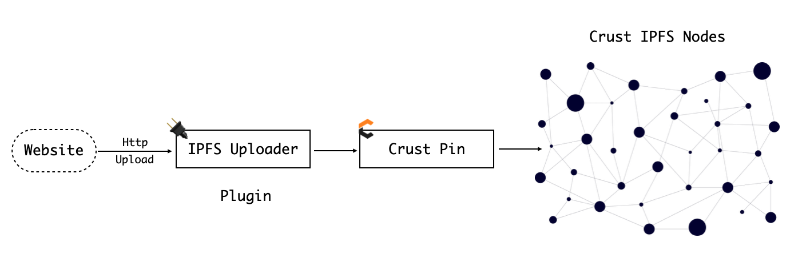

# Crust IPFS Pinner

This repo shows how decentralized pin your site to IPFS by using [ipfs-upload-action](https://github.com/crustio/ipfs-upload-action) and [ipfs-crust-action](https://github.com/crustio/ipfs-crust-action).

## 🎉 Join to play

Please refer [template.yml](./.github/workflows/template.yml) to write your own Github Deploy workflow!

## 📌 Current pinning applications

- [Uniswap Interface](https://github.com/Uniswap/uniswap-interface): Using [uniswap-interface.yml](./.github/workflows/uniswap-interface.yml) to help pin Uniswap on Crust;
- *More*

## 📄 Description

Crust IPFS Pinner's work flow shows below

This flow consist with 2 components:

- **IPFS Uploader**: Plugin action, adapted with all uploader actions, like [Crust IPFS Uploader](https://github.com/crustio/ipfs-upload-action), [Pinata IPFS Uploader](https://github.com/anantaramdas/ipfs-pinata-deploy-action), [IPFS Cluster Uploader](https://github.com/marketplace/actions/add-to-ipfs) and other [uploaders](https://github.com/marketplace?type=actions&query=ipfs).
- **Crust Pin**: [Crust IPFS Pin](https://github.com/crustio/ipfs-crust-action), place a storage order on chain and decentralized pinned by Crust IPFS nodes.

## 👑 Contribution

Feel free to dive in! [Open an issue](https://github.com/crustio/ipfs-crust-pinner/issues/new) or send a PR.

To contribute to Crust in general, see the [Contribution Guide](https://github.com/crustio/crust/blob/master/docs/CONTRIBUTION.md).

## License

[Apache 2.0](LICENSE)
